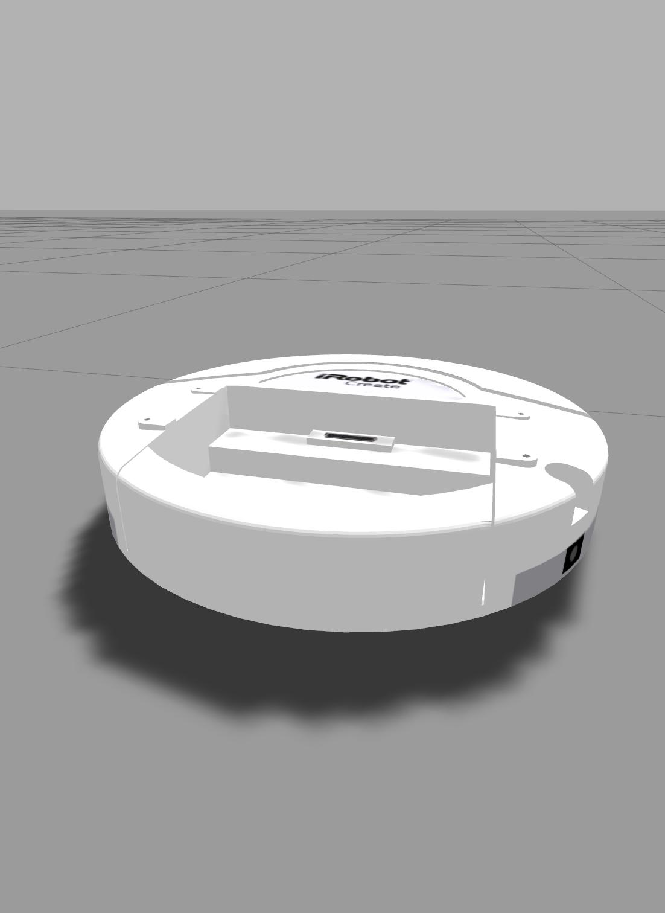

# Social Robot

A python environment for developing interactive learning agent with language communication ability.

## Install dependency
SocialBot is built on top of [Gazebo simulator](http://gazebosim.org). You need to install Gazebo first using the following command:
```bash
curl -sSL http://get.gazebosim.org | sh
```
If you already have a gazebo in your system, please make sure its version is greater than 9.6. You can check gazebo version by running `gazebo --version`. SocialRobot had been tested with Gazebo 9.6 and Gazebo 10.0.

You might need to add the model path in this repp to GAZEBO_MODEL_PATH:
```bash
export GAZEBO_MODEL_PATH=REPO_ROOT/python/social_bot/models:$GAZEBO_MODEL_PATH
```

You also need to install the following packages:
```bash
apt install python3-tk
```

## To compile
```bash
cd REPO_ROOT
git submodule update --init --recursive
mkdir build
cd build
cmake ..
make -j
cd REPO_ROOT
pip3 install -e .
```

## To run test
#### [Simple Navigation Test](examples/test_simple_navigation.py)
```bash
cd REPO_ROOT/examples
python3 test_simple_navigation.py
```
To see the graphics, you can open another terminal and run
```bash
GAZEBO_MODEL_PATH=`pwd`/../python/social_bot/models gzclient
```
#### [Grocery Ground Test](python/social_bot/envs/grocery_ground.py)
```bash
python3 python/social_bot/envs/grocery_ground.py
```

## Environments and Tasks
We provide OpenAI gym interfaces to easily apply different RL algorithms into these different environments. The registered names for them are listed as below:

    SocialBot-SimpleNavigation-v0
    SocialBot-SimpleNavigationDiscreteAction-v0
    SocialBot-SimpleNavigationLanguage-v0
    SocialBot-SimpleNavigationSelfStatesLanguage-v0
    SocialBot-GroceryGround-v0
    SocialBot-GroceryGroundImage-v0
    SocialBot-GroceryGroundLanguage-v0
    SocialBot-GroceryGroundImageLanguage-v0
    SocialBot-GroceryGroundImageSelfStatesLanguage-v0
    SocialBot-Pr2Gripper-v0
    SocialBot-ICubWalk-v0
    SocialBot-ICubWalkPID-v0
Some environments support the teacher-student learning procedure, in which the task is defined by the teacher, and an interaction with the teacher via a sentence is performed during each environment step. You could enable the procedure by using the environment whose name contains "language".

### [Simple Navigation](python/social_bot/envs/simple_navigation.py)
A simple navigation task for a pioneer2dx agent with camera image as observation.

* [Goal task](python/social_bot/teacher_tasks.py).

    A simple navigation task to chase a goal. The agent will receive reward 1 when it is close enough to the goal, and get -1 it becomes too far away from the goal or timeout.

    

### [Grocery Ground](python/social_bot/envs/grocery_ground.py)
A playground with groceries on it. You could choose the agent in the environment by setting the paramenter "agent_type". We support pioneer2dx, pr2, turtlebot, irobot create, and icub for now.
[ICub](http://www.icub.org) is an humanoid robot meant for more complex tasks in the future. You could also choose icub_with_hands, which is a more advanced version of icub equipped with 2 cameras and dexterous hands. The following are images of these 5 robots:

    

The observation of the robots include internal states, target pose or camera image, and language instruction.

* [Goal task](python/social_bot/envs/grocery_ground.py): A task to chase a goal on the playground. The reward setting is the same as simple navigation goal task. A PPO training example can be found [here](examples/grocery_alf_ppo.gin).

     


### [PR2 Gripping](python/social_bot/envs/pr2.py)

* A task where the agent needs to use its grippers or fingers to grip a beer. The observation includes robot internal states and target pose/camera image. Some simple reward shaping is used to guide the agent's gripper to get close to the target, open the gripper and lift the target up. A training example can be found [here](examples/ppo_pr2.gin).

  

### [iCub Walking](python/social_bot/envs/icub_walk.py)

* A simple humainoid walking task. reward = not_fall_bonus + truncked_walk_velocity - ctrl_cost. A PPO and SAC training example can be found [here](examples/).

    

### Training Examples with [Agent Learning Framework (Alf)](https://github.com/HorizonRobotics/alf)
Train simple navigation task with [Alf actor-critic](examples/ac_simple_navigation.gin)
```bash
cd REPO_ROOT/examples/
python -m alf.bin.main --root_dir=~/tmp/simple_navigation --gin_file=ac_simple_navigation.gin --alsologtostderr
```
To play:
```bash
python -m alf.bin.main --root_dir=~/tmp/simple_navigation --gin_file=ac_simple_navigation.gin --play --gin_param='on_policy_trainer.play.num_episodes=20'
```
The playing back can also be recorded to a video file like this:
```bash
python -m alf.bin.main --root_dir=~/tmp/grocery_goal_task --gin_file=grocery_alf_ppo.gin --play --gin_param="on_policy_trainer.play.record_file='grocery.mp4'"
```
You can find the gin config files for other tasks [here](examples).


## Trouble shooting

### python
You need to make sure the python you use matches the python found by cmake. You can check this by looking at REPO_ROOT/build/CMakeCache.txt

### display

You need to make sure your `DISPLAY` environment variable points to a valid display, otherwise camera sensor cannot be created and there will be the following error:
```
[Err] [CameraSensor.cc:112] Unable to create CameraSensor. Rendering is disabled.
...
gazebo::rendering::Camera*]: Assertion `px != 0' failed.
```
You can find out the correct value for `DISPLAY` envorinment variable by running `echo $DISPLAY` in a terminal opened from the desktop. You can verify whether the `DISPLAY` is set correctly by running `gazebo`
