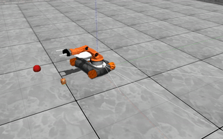

# Social Robot

A python environment for developing interactive learning agent with language communication ability.

## Install dependency
SocialBot is built on top of [Gazebo simulator](http://gazebosim.org). You need to install Gazebo first using the following command:
```bash
curl -sSL http://get.gazebosim.org | sh
```
If you already have a gazebo in your system, please make sure its version is greater than 9.6. You can check gazebo version by running `gazebo --version`. SocialRobot had been tested with Gazebo 9.6 and Gazebo 10.0.

You might need to add the model path in this repo to GAZEBO_MODEL_PATH:
```bash
export GAZEBO_MODEL_PATH=REPO_ROOT/python/social_bot/models:$GAZEBO_MODEL_PATH
```

You also need to install the following packages:
```bash
apt install python3-tk
```

## To compile
```bash
cd REPO_ROOT
git submodule update --init --recursive
mkdir build
cd build
cmake ..
make -j
cd REPO_ROOT
pip3 install -e .
```
if cmake .. complains about cannot find configuration file provided by "gazebo", run
```sudo apt install libgazebo9-dev``` where the version number 9 comes from ```gazebo --version```

## To run test
#### [Play Ground Test](python/social_bot/envs/play_ground.py)
```bash
python3 python/social_bot/envs/play_ground.py
```
#### [Simple Navigation Test](examples/test_simple_navigation.py)
```bash
cd REPO_ROOT/examples
python3 test_simple_navigation.py
```
To see the graphics, you can open another terminal and run
```bash
GAZEBO_MODEL_PATH=`pwd`/../python/social_bot/models gzclient
```

## Environments and Tasks
We provide OpenAI gym interfaces to easily apply different RL algorithms into these different environments. The registered names for them are listed as below:

    SocialBot-PlayGround-v0
    SocialBot-SimpleNavigation-v0
    SocialBot-SimpleNavigationDiscreteAction-v0
    SocialBot-SimpleNavigationLanguage-v0
    SocialBot-SimpleNavigationSelfStatesLanguage-v0
    SocialBot-Pr2Gripper-v0
    SocialBot-ICubWalk-v0
    SocialBot-ICubWalkPID-v0
Some environments support the teacher-student learning procedure, in which the task is defined by the teacher, and an interaction with the teacher via a sentence is performed during each environment step. You could enable the procedure by using the environment whose name contains "language" or through gin configuration.

### [Play Ground](python/social_bot/envs/play_ground.py)
A flexiable environment in which worldfile, tasks and agent are all configurable through gin file. The default configuration for play ground is goal task and pioneer agent.
You can choose the agent type in the environment by setting the paramenter "agent_type". We support pioneer2dx, pr2, turtlebot, kuka youbot, kuka LWR4 and icub for now. [ICub](http://www.icub.org) is an humanoid robot meant for more complex tasks in the future. You could also choose icub_with_hands, which is a more advanced version of icub equipped with 2 cameras and dexterous hands. The following are images of these 5 robots:

    

The common functions for agents like setting observation space and action space are in file [gazebo_agent.py](python/social_bot/gazebo_agent.py). Class GazeboAgent sets those things up according to agent configuration file [agent_cfg.json](python/social_bot/models/agent_cfg.json).

Your can configure the type of observation using gin: with_language or not, use_image or not, and image_with_internal_states or not. Possible situations can be:
    low-dimensional full states,
    low-dimensional full states with language sentence,
    image from the camera of agent,
    image with internal states,
    image with language sentence,
    image with both internal states and language sentence.
By default low-dimensional full states is used.

The action specification is defined in the joint list of file [agent_cfg.json](python/social_bot/models/agent_cfg.json).

Tasks are in file [tasks.py](python/social_bot/tasks.py). To implement a new task, you should:
1. Inherit `tasks.Task`, speficy the compatible agent types in "Task.compatible_agents".
2. Override `Task.__init__()` to set things up.
3. Override `Task.run()` to yeild reward, observation, and optional language string at each time step.
4. Override `Task.task_specific_observation()` to speficy the observation for the task for the non-image case.

The tasks we have for now are listed as below:

* [Goal task](python/social_bot/tasks.py): A task to chase a goal. The agent will receive reward 1 when it is close enough to the goal, and get -1 if it becomes too far away from the goal or timeout. A training example can be found [here](examples/goaltask_sac_pioneer.gin).

     

* [Kicking-ball task](python/social_bot/tasks.py): A task to kick a ball into the goal. Optional reward shaping can be used to guide the agent to run to the ball first.

    

* [Reaching3D task](python/social_bot/tasks.py): A task to reach a 3D position with the end effector of a robot arm. This task is only compatible with Agent kuka_lwr_4plus. An optional distance based reward shaping can be used.

    

* [PickAndPlace task](python/social_bot/tasks.py): A task to grip an object (a wood cube), move and then place it to the target position. An optional reward shaping can be used to guide the agent to grasp cube and move to the position. This task is only compatible with Agent youbot_noplugin. Check for [pickplace_sac_youbot.gin](examples/pickplace_sac_youbot.gin) for a training example using ALF.

    

* [Stack task](python/social_bot/tasks.py): A task to stack several objects (wood cubes). The agent need to grasp the cube and stack it one by one, until all of them are stacked together. The number of cubes can be configured by "objects_num". An optional reward shaping can be enabled to guide the agent to grasp the cube and place to another cube. This task is only compatible with Agent youbot_noplugin. We haven't solve this problem yet, the video below is a human-controlled demonstration.

    


### [Simple Navigation](python/social_bot/envs/simple_navigation.py)
A simple navigation task for a pioneer2dx agent with camera image as observation. This environment is only compatible with goal task and agent pioneer2dx.

* [Goal task](python/social_bot/tasks.py).

    A simple navigation task to chase a goal. The agent will receive reward 1 when it is close enough to the goal, and get -1 it becomes too far away from the goal or timeout.

    

### [PR2 Gripping](python/social_bot/envs/pr2.py)

* A stand-alone task where the agent needs to use its grippers or fingers to grip a beer. The observation includes robot internal states and target pose/camera image. Reward shaping is used to guide the agent's gripper to get close to the target, open the gripper and lift the target up. A training example can be found [here](examples/ppo_pr2.gin).

  

### [iCub Walking](python/social_bot/envs/icub_walk.py)

* A stand-alone simple humainoid walking task. reward = not_fall_bonus + truncked_walk_velocity - ctrl_cost. A PPO and SAC training example can be found [here](examples/).

    

### Training Examples with [Agent Learning Framework (Alf)](https://github.com/HorizonRobotics/alf)
Train goal_task task with [Alf actor-critic](examples/goaltask_sac_pioneer.gin)
```bash
cd REPO_ROOT/examples/
python -m alf.bin.train --root_dir=~/tmp/goal_task --gin_file=goaltask_sac_pioneer.gin --alsologtostderr
```
To play:
```bash
python -m alf.bin.play --root_dir=~/tmp/goal_task --gin_file=goaltask_sac_pioneer.gin --num_episodes=20
```
The playing back can also be recorded to a video file like this:
```bash
python -m alf.bin.play --root_dir=~/tmp/goal_task --gin_file=goaltask_sac_pioneer.gin --record_file=goal_task.mp4
```
You can find the gin config files for other tasks [here](examples). Training curves for the tasks are in folder [here](examples/figures).


### Demonstrating using keyboard and mouse
We have a keyboard interface for the tasks, which can be used to generate demonstrations, potentially can be used for teacher-student learning formula or imitation learning.
Try this for a test:
```bash
cd REPO_ROOT/python/social_bot/
python keybo_control.py
```
Move the agent around by key "W, A, S, D", open or close gripper by key "E", and move the robot arm (if there is, such as agent youbot) by mouse for lef-right, forward-backward direction, and key "R, F" for up-down.
Note that some tricks are used to make the operating more friendly. So you are not controlling the raw joints as the algorthim.
It's not so easy, for some task you may need some trials to complete it. An example:


## Trouble shooting

### python
You need to make sure the python you use matches the python found by cmake. You can check this by looking at REPO_ROOT/build/CMakeCache.txt

### display

You need to make sure your `DISPLAY` environment variable points to a valid display, otherwise camera sensor cannot be created and there will be the following error:
```
[Err] [CameraSensor.cc:112] Unable to create CameraSensor. Rendering is disabled.
...
gazebo::rendering::Camera*]: Assertion `px != 0' failed.
```
You can find out the correct value for `DISPLAY` envorinment variable by running `echo $DISPLAY` in a terminal opened from the desktop. You can verify whether the `DISPLAY` is set correctly by running `gazebo`
